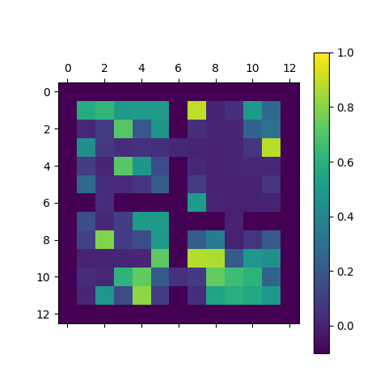
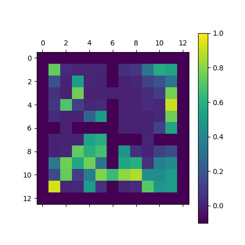
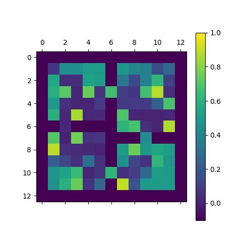
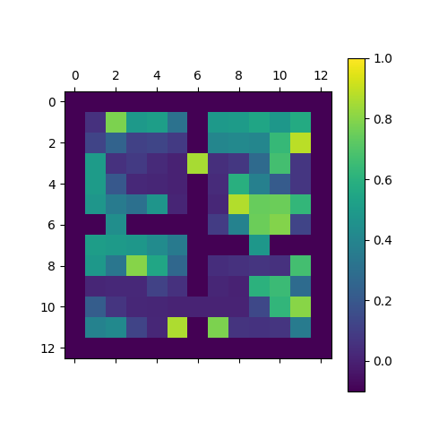

# Prioritized Option-Critic

## Introduction
The [option-critic](https://arxiv.org/abs/1609.05140) is a method for temporal abstraction published recently. While it is capable of learning termination conditions of options, the learned termination probability usually increases step by step over the training process, and thus gradually degrades the effectivenss in recovering sustained options. To cope with it, we propose to allocate different discount factors to options, aiming to prioritize longer options. The proposed variant is demonstrated to be useful for prolonging options in simulation experiments. 

## Motivation
When an agent acts according to a continual option without deliberation, rewards are expected to come quicker with higher degrees of certainty, 

## Formulation


## Experiments
#### Learning process

Along with the learning process, the average duration of options keeps growing when the priority coefficient η > 1.

 | 
:-------------------------:|:-------------------------:
```
python transfer_priority.py --baseline --discount=0.9 --epsilon=0.01 --noptions=4 --lr_critic=0.5 --lr_intra=0.25 --lr_term=0.25 --nruns=100 --nepisodes=5000 --nsteps=1000 --priority=5
```

The cell of goal is changed very 1000 episodes. --noptions=4 --nruns=100 --discount=0.9<sub>

#### Learned termination probability

The options learned by the original option-critic are frequently terminated, whereas the options learned by the prioritized option-critic are more durable.

η = 1 |  |  |  | 
:-------------------------:|:-------------------------:|:-------------------------:|:-------------------------:|:-------------------------:
η = 5 |  |  |  | 
η = 20 |  |  |  | 
```
python transfer_priority.py --baseline --discount=0.9 --epsilon=0.01 --noptions=4 --lr_critic=0.5 --lr_intra=0.25 --lr_term=0.25 --nruns=1 --nepisodes=50000 --nsteps=1000 --priority=5
```

Options are learned from 50000 episodes, during which the goal is changed very 1000 episodes.

## References
- [The Option-Critic Architecture on arXiv:1609.05140](https://arxiv.org/abs/1609.05140)
- [The Option-Critic Architecture on GitHub](https://github.com/jeanharb/option_critic/tree/master/)

## Dependencies
- Numpy
- Argparse
- matplotlib
- dill
- gym 0.7.2
