# Prioritized Option-Critic

## Motivation
* Longer options are preferred for efficient decision making
* Sooner and more certain rewards are likely received when actions are executed without option deliberation

## Formulation
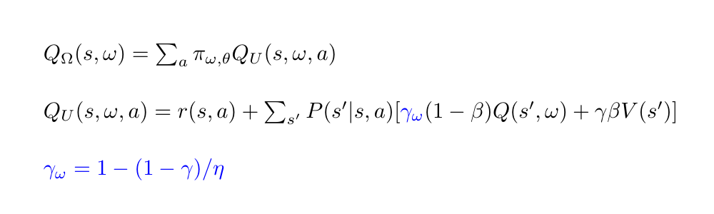

## Result
#### Priority comparison
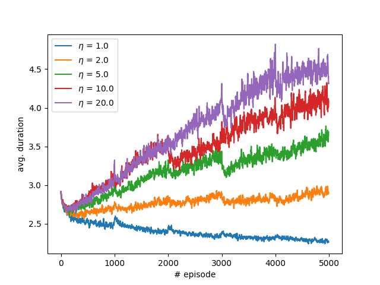 | 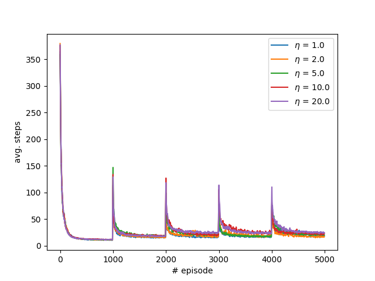
:-------------------------:|:-------------------------:

Goal is changed per 1000 episodes, --noptions=4 --nruns=100 --discount=0.9 

Along with the learning process, the average duration of options keeps growing when the option taken previously is prioritized.

#### Termination probability
η = 5 | 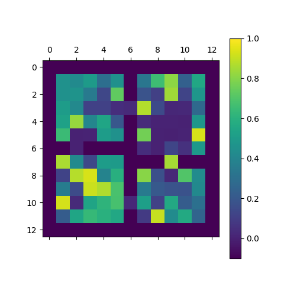 | 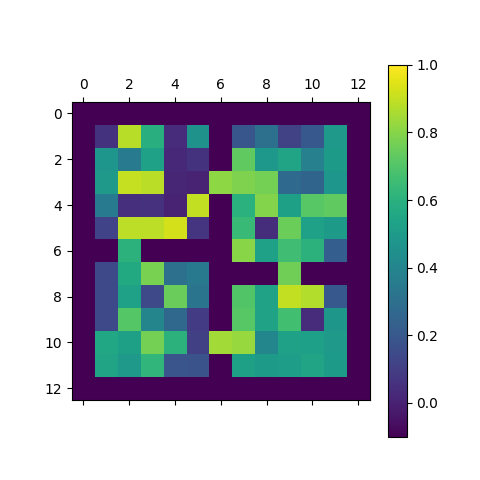 | 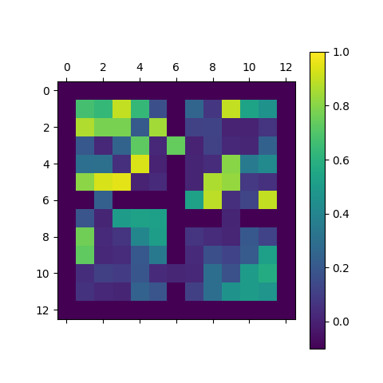 | 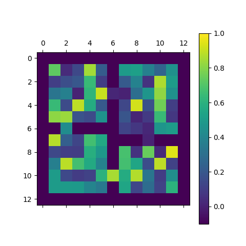
:-------------------------:|:-------------------------:|:-------------------------:|:-------------------------:|:-------------------------:
η = 1 | 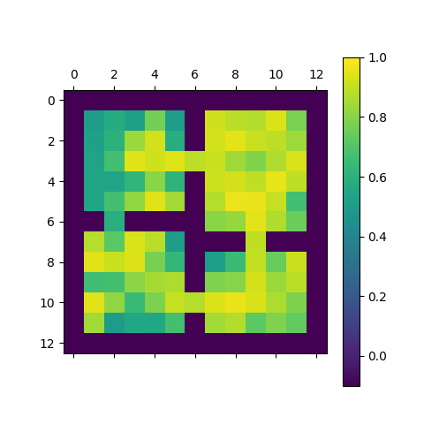 | 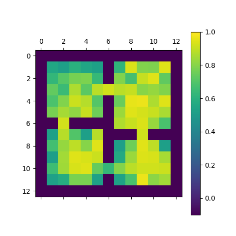 | 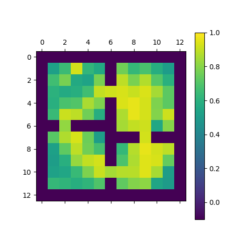 | 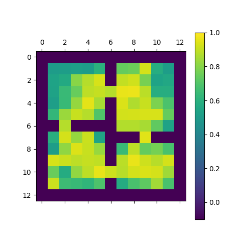

Options are learned in 50000 episodes, during which the goal is changed very 1000 episodes. The options learned from the original option-critic are chopped into primitive actions, whereas the options learned from the prioritized option-critic are more sustained.

## References
- [The Option-Critic Architecture on arXiv:1609.05140](https://arxiv.org/abs/1609.05140)
- [The Option-Critic Architecture on GitHub](https://github.com/jeanharb/option_critic/tree/master/)

## Dependencies
- Numpy
- Argparse
- matplotlib
- dill
- gym 0.7.2
